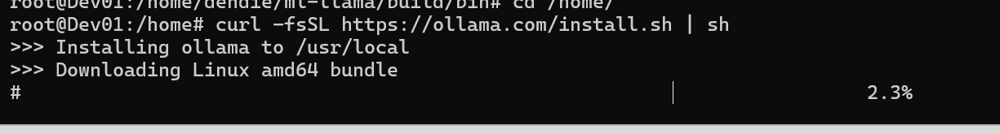
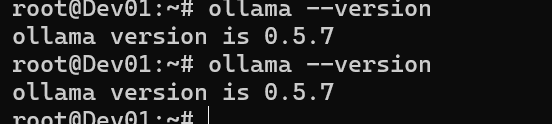
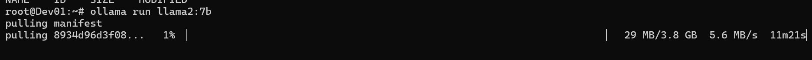
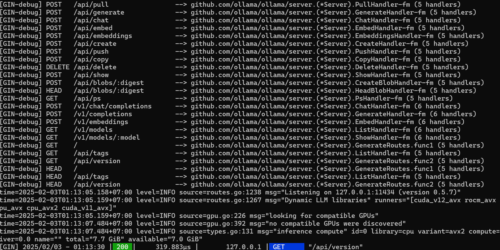
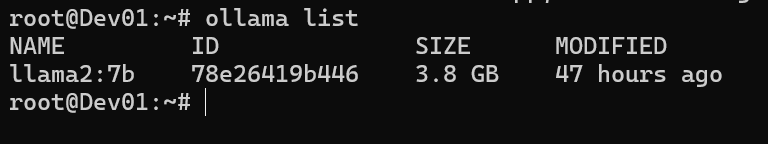
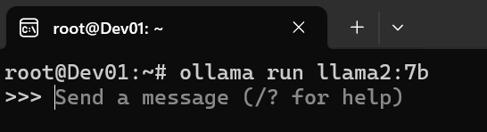
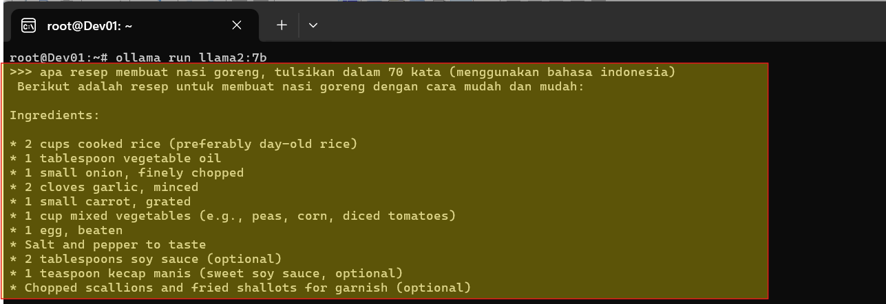

# Machine Learning - LLM 

Machine Learning (ML) adalah cabang dari kecerdasan buatan (AI) yang mempelajari pola dan membuat prediksi 
berdasarkan data. 

LLM, atau Large Language Model, adalah jenis model ML yang dilatih menggunakan sejumlah besar teks untuk 
memahami dan menghasilkan bahasa alami. 

Contohnya adalah GPT-3 dan Llama2, Gemini, Copilot, Meta AI,  yang digunakan untuk tugas seperti penerjemahan, penulisan, dan percakapan. 
LLM bekerja dengan cara mempelajari korelasi dan struktur bahasa dari data pelatihan, 
sehingga dapat menghasilkan teks yang koheren dan relevan dengan konteks. 

Teknik ini memungkinkan aplikasi seperti chatbot, alat tulis otomatis, d
an asisten virtual menjadi lebih cerdas dan bermanfaat.

## 1. Instalasi Ollama

"Ollama" atau Open Large Language Model Assembly adalah platform yang mendukung pengembangan dan penyesuaian 
model bahasa besar (LLM). 

Ollama memfasilitasi peneliti dan pengembang untuk bekerja dengan LLM seperti Llama2 untuk tugas-tugas seperti 
penerjemahan, pembuatan teks, dan analisis bahasa. 

Dengan menyediakan alat dan sumber daya, Ollama mempermudah proses pengembangan model yang dapat memahami 
dan menghasilkan teks dalam berbagai konteks. 

<pre><code>
curl -fsSL https://ollama.com/install.sh | sh
ollama --version </code></pre>

## 2. Ollama Pull LLM 

Pada Ollama dapat pull Mechine Learning yang telah di opensource, untuk di deploy di server 

List Mechine LLM yg dimiliki ollama  dapat dilihat akses di https://ollama.com/search

Sebagai contoh akan mendownload Mechine Learning LLM LLAM Version 2

<pre><code>ollama run llama2:7b </code></pre>

## 2. Ollama Star Server

Hidupkan Server Ollama

<pre><code>ollama serve </code></pre>

## 3. Ollama List Model LLM

Cek model LLM yg telah di pull ke server ollama

<pre><code>ollama list </code></pre>

## 4. Running AI - ML - LLM - Llama 2

Hidupkan AI - ML - LLM - Llama 2

<pre><code>ollama run llama2:7b</code></pre>

## 5. Promt  AI - ML - LLM - Llama 2

Berikan semua pertanyaan untuk di jawab oleh AI - ML - LLM - Llama 2

<pre><code>ollama run llama2:7b</code></pre>

## 6. Promt  AI - ML - LLM - Llama 2 Via API

Berikan semua pertanyaan untuk di jawab oleh AI - ML - LLM - Llama 2

<pre><code>ollama run llama2:7b</code></pre>

## 7 . Prompt AI - ML - LLM - Llama 2 - Via API

Berikan ini memberikan pertanyaan untuk di jawab oleh AI - ML - LLM - Llama 2 via API 
<pre><code>curl -X POST http://127.0.0.1:11434/api/chat -d '{
  "model": "llama2:7b",
  "messages": [
    { "role": "user", "content": "Who is Llama2?" }
  ]
}'</code></pre>

## 8 . Prompt AI - ML - LLM - Llama 2 - Via API Integrsi dengan Frontent HTML + AJax

Berikut ini contoh script untuk Frontent AI - ML - LLM - Llama 2 yang di integrasikan dengan aplikasi frontend 

